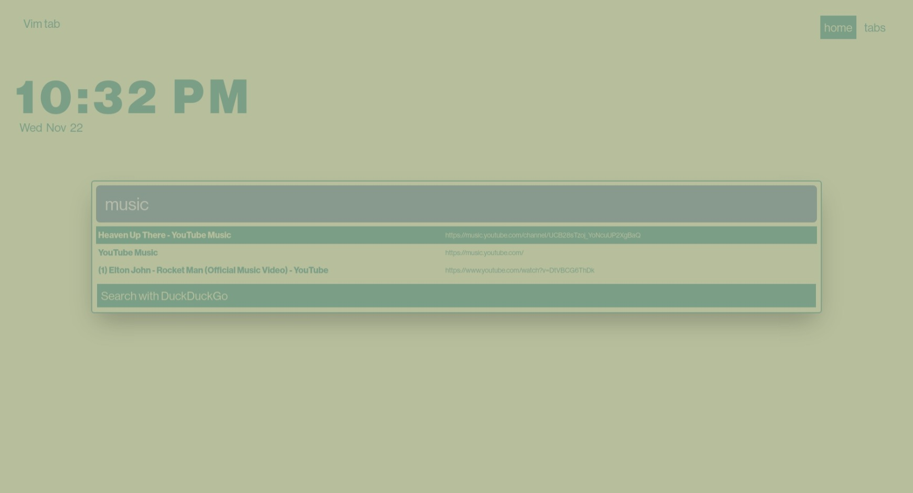
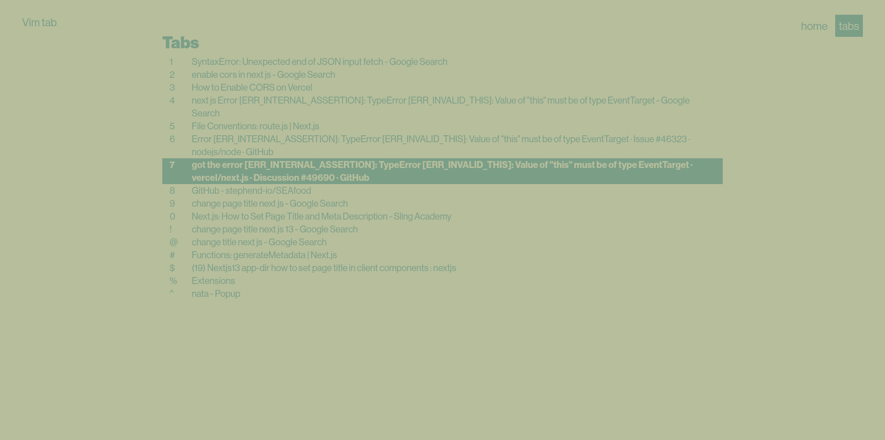

# Vimtab




### Browser extension to extend Vim motion controls to a new-tab

<ol>
<li> Clone, build, and start app

```bash
git clone https://github.com/stephend-io/vimtab
cd vimtab
pnpm i
pnpm build
pnpm start
```

</li>

<li>
Go to your chromium browser's extensions page
<ul>
<li>
chrome://extensions/
</li>
<li>
edge://extensions/
</li>
</ul>
</li>
<li>
Load unpacked and point to newly created build folder on your vimtab directory
</li>
</ol>
